# Ralpher

[](https://github.com/pablozaiden/ralpher/releases/latest)
[](https://github.com/pablozaiden/ralpher/actions/workflows/docker-main.yml)
[](LICENSE)
[](https://bun.sh)

**A web dashboard for managing Ralph Loops** - an autonomous AI development pattern that solves context accumulation in AI coding assistants by using fresh context windows with filesystem-based state persistence.

**[Download Latest Release](https://github.com/pablozaiden/ralpher/releases/latest)**

---

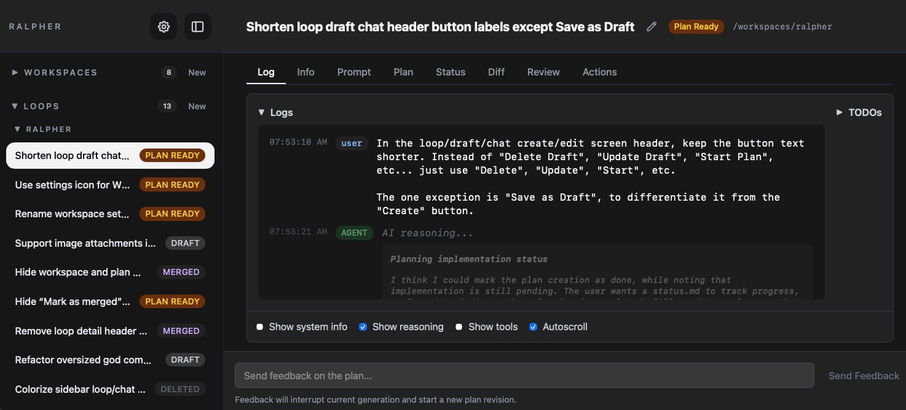

*Real-time log streaming as the AI works*

<details>
<summary><strong>More Screenshots</strong></summary>

### Desktop

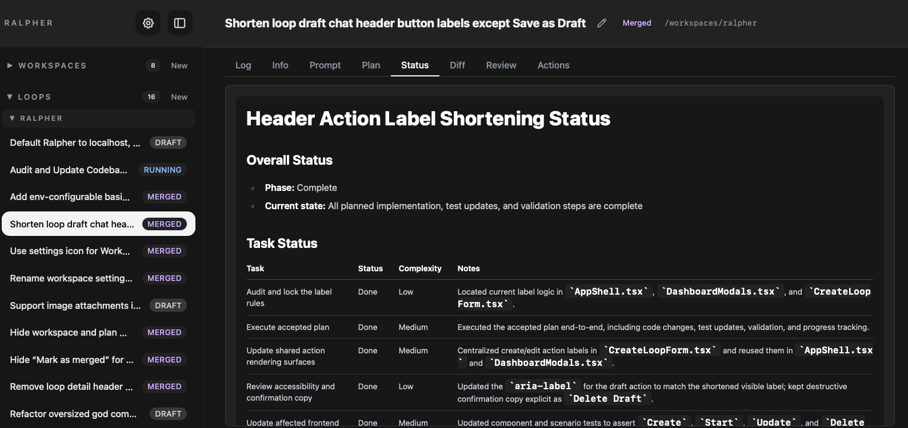

*Loop status overview with iteration progress*

---

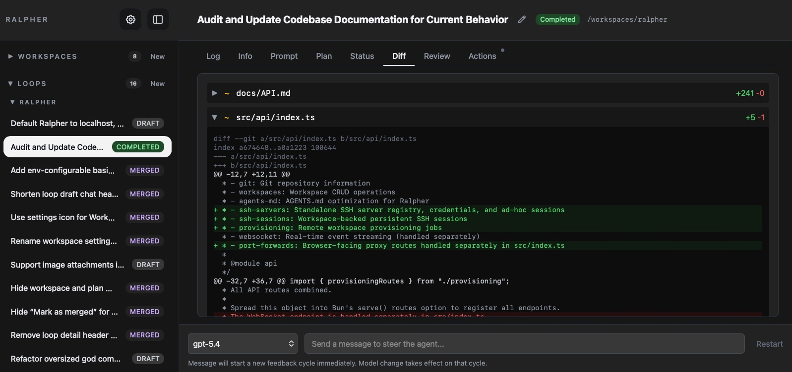

*Side-by-side diff of all changes made*

---

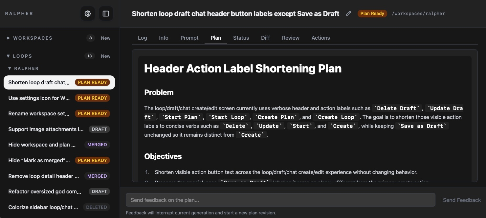

*View the planning documents*

---

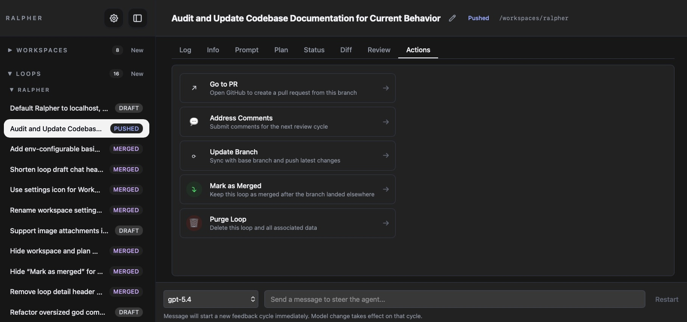

*Loop actions: stop, accept, push, delete*

### Mobile

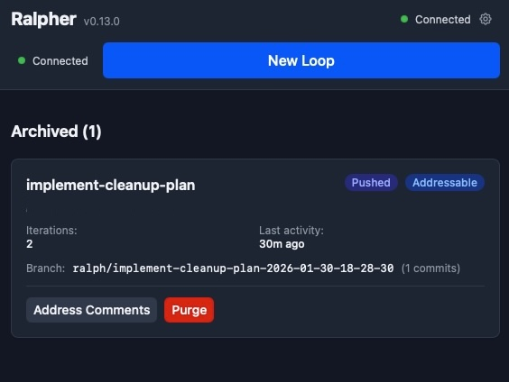

*Dashboard with all active loops*

---


*Create a new loop with prompt and settings*

---

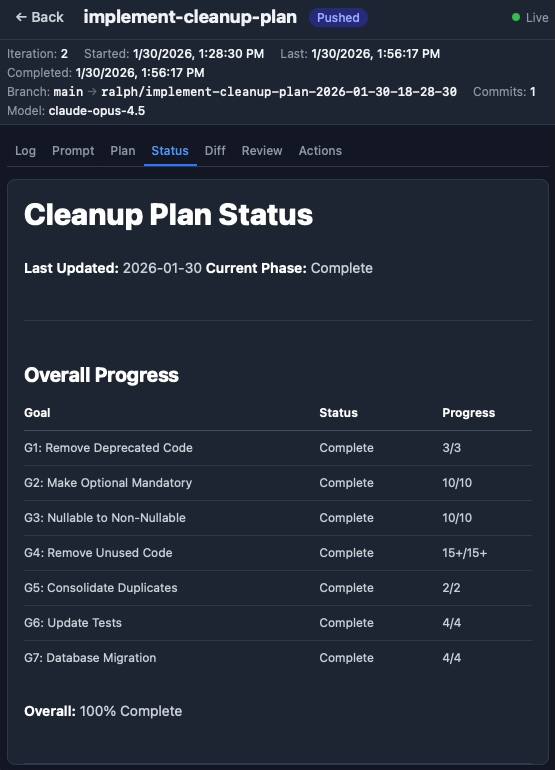

*Loop status on mobile*

---

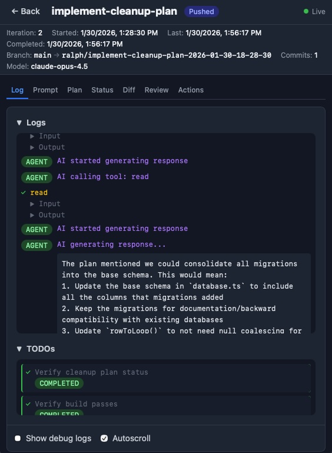

*Live logs on mobile*

---

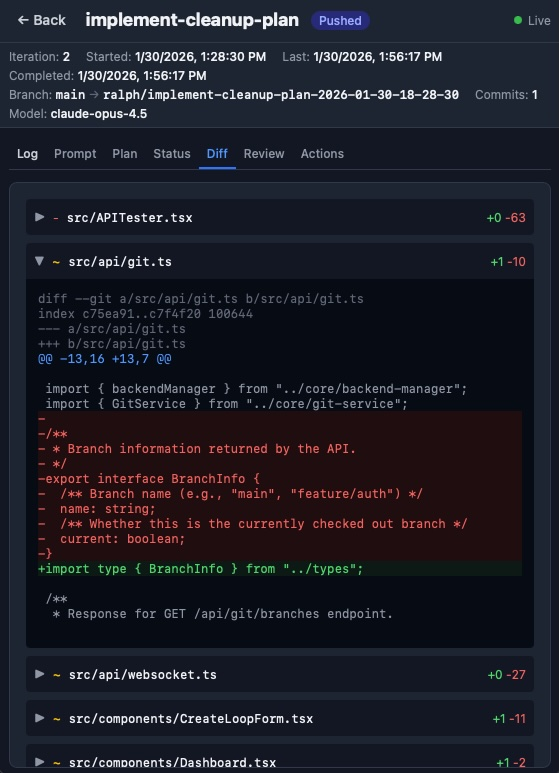

*Code diff on mobile*

---

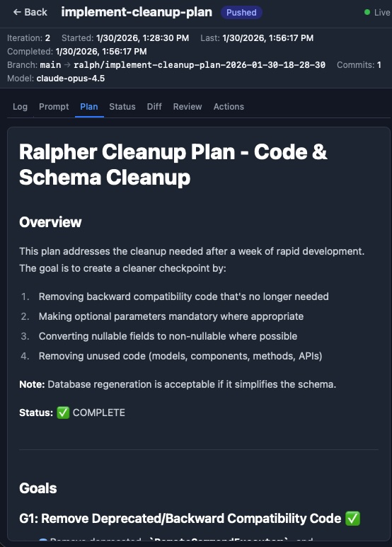

*Planning documents on mobile*

---

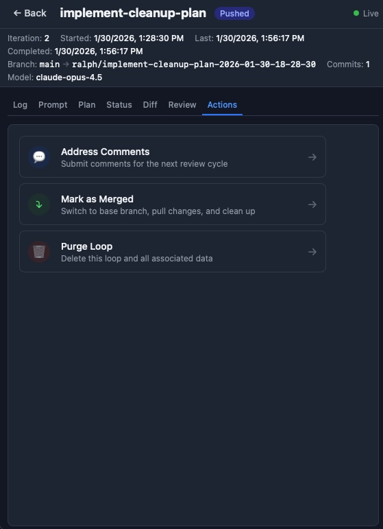

*Loop actions on mobile*

---

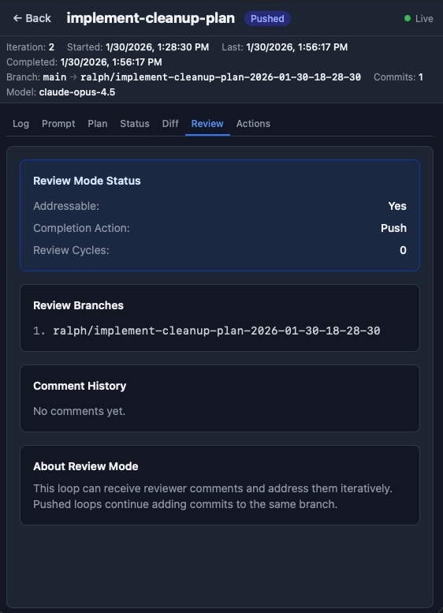

*Review history and comments*

---

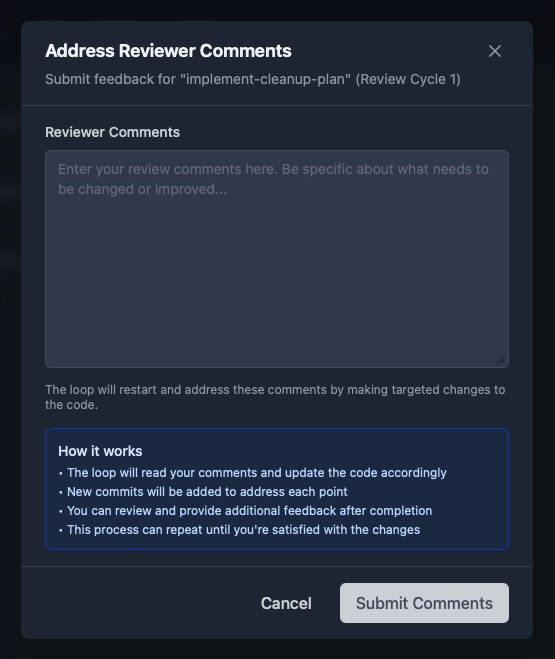

*Address reviewer feedback*

---

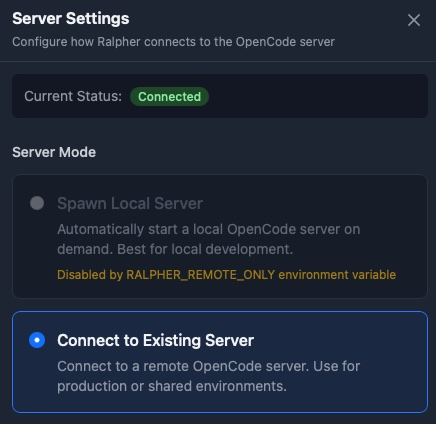

*Server configuration settings*

</details>

---

## What is a Ralph Loop?

A Ralph Loop is an autonomous AI development pattern that uses an external loop to repeatedly feed prompts to an AI agent. The agent works on a task until a specific completion condition is met. Each iteration starts with a fresh context window, relying on the filesystem (via `.planning/` documents) for state persistence.

| Principle | Description |
|-----------|-------------|
| **Fresh Context per Iteration** | Each iteration starts with a clean context window |
| **State Persistence** | Progress tracked via `.planning/plan.md` and `.planning/status.md` in target project |
| **Stop Condition** | Loop terminates when AI output ends with `<promise>COMPLETE</promise>` |
| **Git Safety** | Work isolated in branch, committed per iteration, merged on acceptance |

---

## Installation

**Install the latest release** (recommended):

```bash
curl -fsSL https://raw.githubusercontent.com/pablozaiden/ralpher/main/install.sh | sh
```

This downloads the appropriate binary for your platform (Linux/macOS, x64/arm64) and installs it to `~/.local/bin/ralpher`.

> **Note:** You can also download binaries directly from the [Releases page](https://github.com/pablozaiden/ralpher/releases/latest).

---

## Features

- **Web Dashboard** - Real-time monitoring of multiple concurrent loops
- **REST API** - Full control over loop lifecycle
- **Git Integration** - Automatic branch per loop, commit per iteration, merge on accept
- **Real-time Updates** - Live log streaming via WebSocket
- **Model Selection** - Choose AI models from available providers
- **Review Workflow** - Address reviewer comments iteratively on pushed or merged loops

---

## Quick Start

### Prerequisites

- [Bun](https://bun.sh) v1.3.5+ (for development only)
- Git
- A local [OpenCode](https://opencode.ai) binary in your PATH (for Spawn mode) **or** a remote OpenCode server URL (for Connect mode)

### Running Ralpher

```bash
# Using the installed binary
ralpher

# Or run directly with Bun (development)
bun dev
```

The web UI will be available at `http://localhost:3000` (configurable via `RALPHER_PORT`).

### Creating Your First Loop

1. Click **"New Loop"** in the dashboard
2. Select a workspace (or create one with the project directory path)
3. Write your task prompt (the PRD/requirements)
4. Select a model and configure max iterations
5. Click **"Create"** - the loop starts automatically and its name is auto-generated from the prompt

---

## Configuration

| Variable | Description | Default |
|----------|-------------|---------|
| `RALPHER_PORT` | Server port | `3000` |
| `RALPHER_DATA_DIR` | Data directory for persistence | `./data` |
| `RALPHER_REMOTE_ONLY` | Disable spawn mode, only allow remote connections (`true`/`1`/`yes`) | unset |
| `RALPHER_LOG_LEVEL` | Override server log level (`silly`, `trace`, `debug`, `info`, `warn`, `error`, `fatal`) | `info` |

### Data Storage

Ralpher stores all data in a SQLite database:

```
data/
├── ralpher.db       # SQLite database (loops, sessions, preferences)
├── ralpher.db-shm   # SQLite shared memory (runtime)
└── ralpher.db-wal   # SQLite write-ahead log (runtime)
```

---

## Usage Guide

<details>
<summary><strong>Monitoring a Loop</strong></summary>

1. Click on a loop card to view details
2. Watch real-time logs as the AI works
3. Use the **"Prompt"** tab to modify the next iteration's prompt
4. Use the **"Diff"** tab to see changes made so far

</details>

<details>
<summary><strong>Accepting Changes</strong></summary>

When a loop completes (or you stop it manually):

1. Review the diff tab to see all changes
2. Click **"Accept (Merge)"** to merge the branch into the original
3. Or delete the loop to discard changes

</details>

<details>
<summary><strong>Addressing Reviewer Comments</strong></summary>

After accepting or pushing a loop, you can iteratively improve the work based on reviewer feedback.

#### For Pushed Loops

1. Complete a loop and click **"Push"** to push the branch to the remote
2. Loop status becomes "Pushed" with an "Addressable" badge
3. After code review, click **"Address Comments"** button
4. Enter reviewer feedback in the modal
5. The loop restarts on the same branch to address the comments
6. Push again after completion - cycle repeats as needed

#### For Merged Loops

1. Complete a loop and click **"Accept (Merge)"** to merge into main/base branch
2. Loop status becomes "Merged" with an "Addressable" badge  
3. After reviewing the merged changes, click **"Address Comments"**
4. Enter feedback about what needs improvement
5. The loop creates a new review branch (`<branch-prefix><name>-review-<N>`)
6. Work is done on the review branch, then merged back to main
7. Merge again after completion - cycle repeats as needed

#### Review History

The **"Review"** tab shows:
- Comment history with status badges (Pending/Addressed)
- Number of review cycles completed
- List of review branches created

</details>

<details>
<summary><strong>Modifying In-Flight</strong></summary>

While a loop is running:

- Use the **"Prompt"** tab to set a "pending prompt" for the next iteration
- The current iteration continues with its original prompt
- The next iteration will use your updated prompt

</details>

---

## API Reference

See [docs/API.md](docs/API.md) for complete API documentation.

---

## Technology Stack

| Category | Technology |
|----------|------------|
| Runtime | [Bun](https://bun.sh) 1.3.5+ |
| Language | TypeScript (strict mode) |
| Frontend | React 19 |
| Styling | Tailwind CSS v4 |
| AI Integration | [@opencode-ai/sdk](https://opencode.ai) |
| Real-time | WebSocket |

---

## Development

### Setup

```bash
git clone https://github.com/pablozaiden/ralpher.git
cd ralpher
bun install
bun dev
```

### Building

```bash
# Build standalone executable
bun run build

# Run the executable
./dist/ralpher
```

The build creates a single standalone executable that includes the Bun runtime and all dependencies.

### Cross-compilation

```bash
bun run build --target=bun-linux-x64
bun run build --target=bun-linux-arm64
bun run build --target=bun-darwin-x64
bun run build --target=bun-darwin-arm64
```

### Testing

```bash
bun run test           # Run all tests
bun run tsc            # Type check
```

### Code Style

See [AGENTS.md](AGENTS.md) for detailed coding guidelines.

---

## Server Modes

Ralpher supports two modes for connecting to the opencode backend:

| Mode | Description |
|------|-------------|
| **Spawn** | Ralpher spawns a local opencode server process automatically |
| **Connect** | Ralpher connects to a remote opencode server via URL |

Both modes work identically from the user's perspective.

### Per-Workspace Server Configuration

Each workspace has its own server configuration, allowing you to:

- **Run multiple workspaces in parallel** with different server settings
- **Connect to different remote servers** for different projects
- **Mix spawn and connect modes** across your workspaces

To configure server settings for a workspace:

1. Click the **gear icon** next to a workspace name in the dashboard header
2. Select **Spawn** mode (local) or **Connect** mode (remote server)
3. For Connect mode, enter the hostname, port, and authentication details
4. Click **Test Connection** to verify the settings
5. Click **Save Changes** to apply

Changes take effect immediately - the workspace connection will be reset to use the new settings.

---

## Docker

```yaml
services:
  ralpher:
    image: ghcr.io/pablozaiden/ralpher:latest
    ports:
      - "8080:8080"
    volumes:
      - ralpher-data:/app/data
    environment:
      - RALPHER_DATA_DIR=/app/data

volumes:
  ralpher-data:
```

---

## Contributing

1. Fork the repository
2. Create a feature branch
3. Make your changes with tests
4. Run `bun run build && bun run test`
5. Submit a pull request

---

## License

[MIT](LICENSE)
